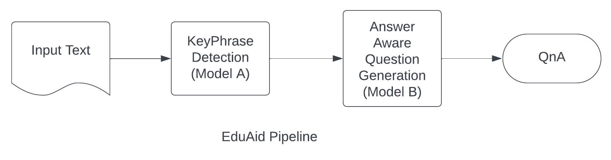

# EduAid🚀: Short Quiz Generation for assisting online learning 🖥️


## Introduction
I am Prarabdh Shukla, a final year undergrad student in Computer Science at the Indian Institute of Technology Bhilai. I am an active follower of the happenings in the domain of Dimensionality Reduction, Federated Learning and AI in general. 

In the summer that followed my Junior year of undergrad, I was fortunate enough to be selected as a Google Summer of Code ☀️ contributor at the [Australian Open Source Software Innovation and Education (AOSSIE) Community](https://aossie.gitlab.io/). I was tasked with developing AOSSIE's new project: [EduAid](https://github.com/AOSSIE-Org/EduAid). A new project brings with it a lot of difficulties as one has to think stuff right from scratch. This was also AOSSIE's second project in the domain of AI, which means, I would not have the experience of many contributors and the path to this project must be paved by me and my mentors. 


 &nbsp;&nbsp;&nbsp;&nbsp;&nbsp;&nbsp;&nbsp;&nbsp;&nbsp;&nbsp;&nbsp;&nbsp;&nbsp;&nbsp;&nbsp;&nbsp;&nbsp;&nbsp;&nbsp;&nbsp;&nbsp;&nbsp;&nbsp;&nbsp;&nbsp;&nbsp;&nbsp;&nbsp;  &nbsp;&nbsp;&nbsp;&nbsp;&nbsp;&nbsp;&nbsp;&nbsp; .png) 

As has always been said, _It is not about the destination, it is about the journey_, this article is my final Google Summer of Code'23 submission and also the story of the enriching and fantastic summer I spent at AOSSIE, working on one the most challenging projects I have ever taken up. 


## Before the Coding began (Community Bonding Period) ⏳

Our goal for this year's GSoC was pretty straightforward: _Create a Browser Extension that generated a short Quiz based on user input_. However, there were multiple things that were not so straightforward. In my proposal, I had decided upon a complex pipeline of 4 fine tuned T5 models that would work in combination to yield QnA. I did know before hand that there would be a crunch in computing resources and therefore decided to use the T5-base which is reasonably small for an LLM (~220M parameters) but still big enough to remember the nuances of the natural language. 

The first question that would come to one's mind in today's day and age is, _"Why not use GPT?"_. While a person would have frowned at that statement a few years ago, when GPT meant the GPT-2 model (which is big, and when I say big, I mean ~1.5B parameters big). However, ever since ChatGPT was released, GPT-3.5 and GPT-4 are being used in ton of LLM based applications. My stance was always against using any model from the GPT family right from the start because:

1. Firstly, these models are not open source, which means our application would not run locally. This can be a big concern, as people are becoming more and more conscious of where their data is going

2. Secondly, GPT-3 and GPT-4 API calls are not free, and one is billed according to each query. I envisioned this project to be a tool that people would use openly in schools, universities, and even for self learning. Having such a wide audience is only possible when the software doesn't burn a hole in your pocket. 

3. Thirdly, it would be a real irony if in the name of open-source contribution, we used a not-so-open model like GPT-3.5/GPT-4 (pun intended)

Jokes apart, I am not actually disowning GPT altogether as an idea. ChatGPT is an engineering marvel and possibly one of the biggest boosts the Transformers and the Attention architecture has given to the world. And using it also requires clever prompt engineering and prompt chaining to achieve good results. I have plenty of ideas to integrate GPT into the application providing optional features (look out for issues on the repo 👀), but I felt that GPT should not be the basis of the entire application itself. 

Now that I have made it clear what my stance is with respect to GPT-3 and other variants, we go back to T5. Due to GPU constraints, in the community bonding period, we decided to reduce the pipeline to 2 models and defer the other two for later. As of now, the two models that I use are as follows:

1. *Model A*: Model A, performs KeyPhrase Detection. For the uninitiated, KeyPhrase Detection is the task of figuring out the keywords from the input text. This usually finds application with research paper abstracts, where an AI model learns to figure out the keywords from the abstract of a research paper.


2. *Model B*: Model B performs Answer Aware Question Generation. Now, that's a mouthful, so let us break it down. This model basically given an input, generates questions from it. What is the input? The input is answers and context. If we give this model the context and the answers, it will generate questions whose answers will be the answers provided in the input. 

How these two were intended to work together must be clear by now. Given an input text $T$, model A would extract keyphrases $A(T)$ from it and then model B would be fed with the text as the context and the keyphrases as the answers to generate questions $B(A(T), T)$ and the final output would be the question answer pair: $[B(A(T),T), A(T)]$. 



Before the coding period began, I did a few experiments on my local machine on CPU (Its okay, I frowned just as bad as you are right now when I tried training a T5 on CPU. For the record, it was 3 epochs ~ 3 hours 😭). But the intention was never to train T5 but was to see if the proposed pipeline was any good. It was also at this stage that I tried out [KeyBERT](https://github.com/MaartenGr/KeyBERT) and [KeyPhraseVectorizers](https://github.com/TimSchopf/KeyphraseVectorizers) in anticipation of a GPU crunch, which as you shall learn in the coming sections, thankfully never happened. However these two remain directions worth exploring. 

## Training Phase 📈
The biggest asset as well as the biggest challenge of this project was that we had decided to fine tune our own model. I chose Google's T5 because it had a text to text framework, which made it much like modern day LLMs as it could accept prompts. T5 had many variants with 220M, 700M, 3B, and 11B parameters. I chose the 220M T5-base for very obvious reasons: GPU constraints. Although we had access to a remote server with a very high end GPU for training, the application is to be ultimately used by common-folk. Even deployment costs would go up if we deploy the backend on an AWS instance that has GPU. Moreover, if someone wants to run the application locally, they cannot do so if we used too big of a model. 

### Training Data 📚
The best part about this project was that we had plenty of data available in the right format. Most innovative AI projects in modern date suffer from data shortage, but Question Answering is a traditional NLP task that has been explored even before Transformers were the norm. We had two tasks as mentioned before: 1. KeyPhrase Detection 2. Answer Aware Question Generation. 

For the former, we used the [KP20K Dataset](https://huggingface.co/datasets/taln-ls2n/kp20k). This is a dataset of Document titles, their abstracts and their keyphrases. 

For the later, we used the [Stanford Question Answering Dataset (SQuAD) v1.1](https://rajpurkar.github.io/SQuAD-explorer/explore/1.1/dev/). This is a dataset of questions, answers and their context. 

### Training Process

#### Model A
Due to inconsistent availability of resources and due to having trained on multiple platforms, our training was not a smooth path. The model was frequently checkpointed to ensure transferrability between two different machines. The scripts used for this training can be found at `Model_training/Keyphrase Detection`. 

For KeyPhrase detection, the model was provided with the Abstract and it had to detect keyphrases. The prompt provided to the LLM was:

```
detect keyword: abstract:{abstract}
```

A few years ago, this methodology of providing a prompt to T5 for performing a task different than what it was pre-trained on would have required some explanation, but nowadays, with the advent of LLMs, it needs no introduction. 

We used an AdamW optimizer with a learning rate of 2e-5, with a StepLR scheduler for the learning rate, with step size 1 and gamma=0.1 for training T5 for KeyPhrase Detection. 

#### Model B
By the time we finished training Model A, all our issues with regards to the GPU unavailability were resolved, and the project finally picked up pace. The model was trained with settings similar to Model A. The training scripts and other code related to it can be found at `Model_training/AnswerAwareQG`.

For the training, ur stack mainly included PyTorch 🔥 and HuggingFace 🤗. The datasets that were used were obtained from 🤗 Hub. 

### Development Phase 👨🏻‍💻

The most challenging aspect about this project was that it required contribution from all angles. It needed quite a bit of brainstorming to figure out a design for the pipeline and the overall architecture of the application. It also required some AI expertise to select the right LLM, to train it with the right datasets, etc and it also required to be put into working condition, all in a mere 12 weeks. 

The first question to answer was how are AI models supposed to run in the web? We explored ONNX formats, used all sorts of methods to convert our models into the ONNX format, ranging from using PyTorch routines to even using 🤗 Optimum. Using 🤗 Optimum CLI, I was able to get the models in ONNX format but the issue was that the tokenization part was not incorporated into this. The model accepts tokenized input which was not a part of the ONNX model. 

There is no denying the fact that people have run transformer models in the web (although there are only a handful of examples), but most applications deploy these onto a backend server and the front end merely makes API calls to the server. We decided to do the same. 

We setup a simple HTTP python server in the backend that accepts the input text, runs it through the pipeline and then sends the QnA back to the front end in a JSON format. 

Once done with server, I spent some time on the UI and finally the extension was ready!


## What's Next?
This was just the first summer this project has seen. I intend to make the 'summer' last by working on this project regularly. In the time that I have spent on this project, many of my ideas have matured and I have developed some new ideas too. I am looking forward to really enjoyable weekends after Summer of Code, where I would definitely spend a few hours working on EduAid and hopefully push this to the next level by the time the next summer comes round the corner.

## Acknowledgments

This project was made possible due to the support of many individuals. I would like to thank the [AOSSIE](https://aossie.gitlab.io/) community for providing me the opportunity. Special thanks to the org admin Bruno, who has supported me throughout my Google Summer of Code in all sorts of administrative tasks and has also encouraged me from time to time. A big word of thanks to my mentors, Divyanshu and Harsh, without whom, none of this was possible. They helped me with all my problems- no matter how silly or how complex. Lastly, I would also like to extend a big big thanks to [Dr Soumajit Pramanik](https://www.iitbhilai.ac.in/index.php?pid=soumajit) from IIT Bhilai who happily let me use his remote server, which has one of the best GPUs in the market right now. Without his timely help, this project was not possible.
